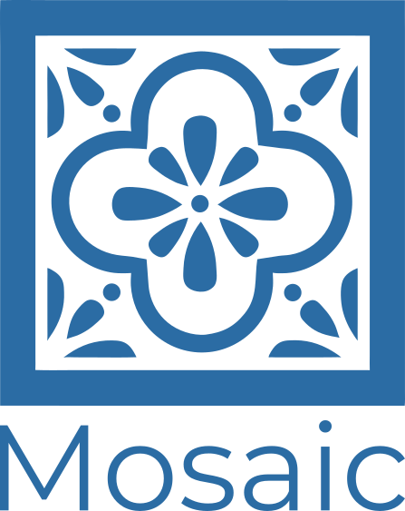

<p align="center">
  
</p>

<p align="center"><b>Server-Driven UI for real Kotlin Multiplatform teams</b></p>
<p align="center">One backend describes the screen. One Compose Multiplatform client renders it — on Android, iOS, Desktop and Web.</p>

<p align="center">
  <a href="https://search.maven.org/search?q=g:dev.catbit+a:mosaic-core"></a>
  
  
  
  <a href="https://rodrigoferreira001.github.io/Mosaic/"></a>
  
  
</p>

<p align="center">
  <a href="https://rodrigoferreira001.github.io/Mosaic/showroom/">
    
  </a>
  <br />
  <sub>sample-client (wasmJs) on GitHub Pages, talking to sample-server on Cloud Run — see "Deploying the showroom" below</sub>
</p>

---

Mosaic is a **Server-Driven UI framework**: the backend describes a screen — its components, layout, styling, data bindings and interaction logic — as a serialized tree, and the client (Android, iOS, Desktop, Web) deserializes and renders it live with Compose Multiplatform. There is no per-platform UI code to write for a new screen, and no client build to ship when a screen changes.

It's also, deliberately, a **real KMP project on both sides of the wire**: the DSL your backend team writes (`mosaic-server`) and the schemas it produces (`mosaic-core`) are the same Kotlin types the client (`mosaic-client`) deserializes and renders — no OpenAPI codegen, no hand-written parallel models, no drift between what the server means and what the client understands. If you already have Kotlin on the backend, Mosaic gives you a genuinely shared contract instead of a JSON convention everyone promises to keep in sync.

This is a personal project, built and maintained by one person, and it's under active development. Some subsystems (persisted data, offline caching, a few event/tile combinations) are still being reworked; everything documented below is implemented and runnable, not aspirational. The current focus and open items are tracked in [`ROADMAD.md`](ROADMAD.md).

## Why this exists

A native client and a JSON-over-HTTP backend agree on a fixed UI contract at build time. Changing that contract — adding a field to a form, reordering a screen, changing what a button does on success versus failure — means shipping new client code, through app store review, on every platform you support. If you support Android, iOS, desktop and web from one team, you're maintaining the same screen logic four times.

Server-Driven UI moves that contract from build time to request time. The client stops hardcoding screens and becomes a generic interpreter for a fixed vocabulary of components (**Tiles**) and behaviors (**Events**). The backend team owns screen composition, conditional logic, network orchestration and navigation — in type-safe Kotlin — and ships changes without touching the client binary.

Mosaic is a full implementation of that idea: a shared type-safe contract (`mosaic-core`), a backend DSL that builds that contract (`mosaic-server`), and a rendering/execution engine that consumes it (`mosaic-client`).

## Setup

All three modules are published to Maven Central under `dev.catbit`. `mosaic-core` holds the shared Schemas that both the server DSL and the client renderer are built on, and it's declared as an `implementation` (not `api`) dependency on both sides — add it explicitly alongside whichever module you're pulling in.

### Server setup

**`gradle/libs.versions.toml`**
```toml
[versions]
mosaic = "1.1.0"

[libraries]
mosaic-core = { module = "dev.catbit:mosaic-core", version.ref = "mosaic" }
mosaic-server = { module = "dev.catbit:mosaic-server", version.ref = "mosaic" }
```

**`build.gradle.kts`**
```kotlin
dependencies {
    implementation(libs.mosaic.core)
    implementation(libs.mosaic.server)
}
```

Or with direct coordinates:

```kotlin
dependencies {
    implementation("dev.catbit:mosaic-core:1.1.0")
    implementation("dev.catbit:mosaic-server:1.1.0")
}
```

That's the whole backend footprint — `mosaic-server` is a plain JVM library, no Ktor server required by the DSL itself (`sample-server` just happens to use Ktor to expose it over HTTP).

### Client setup

**`gradle/libs.versions.toml`**
```toml
[versions]
mosaic = "1.1.0"

[libraries]
mosaic-core = { module = "dev.catbit:mosaic-core", version.ref = "mosaic" }
mosaic-client = { module = "dev.catbit:mosaic-client", version.ref = "mosaic" }
```

**`build.gradle.kts`** (inside a Compose Multiplatform module's `commonMain` source set)
```kotlin
kotlin {
    sourceSets {
        commonMain.dependencies {
            implementation(libs.mosaic.core)
            implementation(libs.mosaic.client)
        }
    }
}
```

Or with direct coordinates:

```kotlin
commonMain.dependencies {
    implementation("dev.catbit:mosaic-core:1.1.0")
    implementation("dev.catbit:mosaic-client:1.1.0")
}
```

`mosaic-client` targets Android, iOS (`iosArm64`/`iosSimulatorArm64`), Desktop (`jvm`) and Web (`wasmJs`) — pick whichever of those your Compose Multiplatform module already targets, nothing extra to configure per-platform. `mavenCentral()` needs to be in your `dependencyResolutionManagement`/`repositories` block, same as any other Central-hosted dependency.

## A screen, in the DSL

```kotlin
// mosaic-server
Screen(id = "login") {
    Column {
        TextField(id = "email", label = "Email")
        TextField(id = "password", label = "Password", visualTransformation = keyboardVisualTransformationPassword())

        Button(
            id = "submit",
            text = "Sign in",
            events = {
                SendNetworkRequest(
                    trigger = EventTriggers.onClick(),
                    url = "/api/login",
                    method = HttpMethod.POST,
                    events = {
                        UpdateData(
                            trigger = EventTriggers.onSuccess(),
                            updates = {
                                update(
                                    dataSource = applicationSegmentedData("auth"),
                                    updateData = explicitIncomingUpdateData(dataId = "session")
                                )
                            },
                            events = {
                                Navigate(trigger = EventTriggers.onSuccess(), destination = "home", navigatorId = "root")
                            }
                        )
                        DisplaySnackbar(trigger = EventTriggers.onFailure(), message = "Login failed")
                    }
                )
            }
        )
    }
}
```

Nothing in that tree references platform code. The client that renders it doesn't know "login" exists ahead of time — it knows how to render a `Column`, a `TextField`, a `Button`, and how to run `SendNetworkRequest` → `UpdateData` → `Navigate`/`DisplaySnackbar` as a chained event graph, because those are part of the fixed vocabulary shipped in `mosaic-core`/`mosaic-client`. Event chaining is driven entirely by trigger matching (`onSuccess()`, `onFailure()`, ...) on each node's `events` field — there's no callback wiring to write on the client side, and no code generation step in between.

Bootstrapping a client is a single composable:

```kotlin
// mosaic-client (Compose entry point)
MosaicApplication(
    applicationId = "MyApp",
    baseUrl = "https://api.example.com",
    appSplash = { Text("Loading…") }
)
```

## What can I display with Mosaic?

Everything you'd expect from a Material 3 app: text, buttons, chips, inputs, images, cards, grids, tabs, navigation bars, dialogs, snackbars, progress indicators, and more — 48 components in total, all driven entirely by the server. Browse the full catalog live in the [showcase](https://rodrigoferreira001.github.io/Mosaic/showroom/).

## What can I do with Mosaic?

API calls, reading and writing data, navigation, permissions, camera/gallery access, file uploads and downloads, timers, theming — chained together declaratively from the backend, no client-side glue code. 67 events in total, also browsable live in the showcase.

## Running the samples

```bash
# Ktor backend, serves sample screens on :9090 — this is what powers the showcase
./gradlew sample-server:run

# Desktop client
./gradlew sample-client:run

# Everything
./gradlew build
```

## License

[Apache License 2.0](LICENSE).
